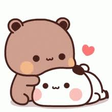
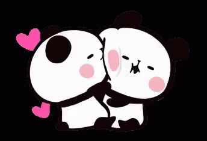

<html lang="en">
<head>
<meta charset="UTF-8">
<title>Bandana ❤️</title>
<meta name="viewport" content="width=device-width, initial-scale=1.0">

</head>

<body>

  <h1>Hey Bandana ❤️</h1>
  
 This little card carries pieces of my heart…  
  Even if miles stand between us right now, my feelings for you have never felt closer.  
  Distance may test us, but it will never change what you mean to me❤️😭

  <button class="next">Next ➝</button>

  <h1>You Are My Safe Place 🌸</h1>
  
  
When the world feels heavy, you make everything lighter.
    No matter how loud the world becomes, my heart feels calm when I think of you.  
  Even from far away, you are still my comfort, my peace, my home.  
 loving you fills every empty space😭🫂❤️
  

  <button class="next">Next ➝</button>

  <h1>Us, Always 🐻💕</h1>
  
  
I don’t need perfect moments, I just need you.
   I wish we might  side by side right now, but we are still heart to heart.  
  Every memory we created, every laugh we shared, every quiet moment —  
  they remind me that what we have is real, strong, and worth holding onto❤️❤️
  

  <button class="next">Next ➝</button>

  <h1>No Matter What 🌈</h1>
  
  

     I know things aren’t easy.  
  Circumstances pulled us apart, but they never pulled my heart away from you.  
  Your overthinking, your tears, your dreams, your fears —  
  I don’t love you in parts… I love you completely😭💗
  

  <button class="next">Next ➝</button>

  <h1>Some Gifts for You 🎁</h1>
  
🎁

  

     These aren’t things you can unwrap with your hands…  
  They’re pieces of reassurance, loyalty, and promises.  
  Because even when I can’t be there physically,  
  I still want you to feel chosen, valued, and deeply loved❤️

  <button class="next">Open ➝</button>

  <h1>💌 A Letter</h1>
  

    Dear Bandana,  
    Loving you is my favorite feeling.   
  Not just for your smile or your laugh —  
  but for your heart, your strength, and the way you care so deeply.  
  No situation, no distance, no misunderstanding  
  can erase what I feel for you❤️🫂
  

  <button class="next">Next ➝</button>

  <h1>🤞 A Promise</h1>
  

    I promise to listen when you overthink,  
    hold you when you cry,  
    and stand with you when life feels unfair. 
  I promise to be patience, to be understanding,  
  and to protect what we built together.  
  No matter how long it takes,  
  my heart still chooses you — every single day😭❤️
  

  <button class="next">Next ➝</button>

  <h1>📸 Our Memories</h1>
  

    Every late-night talk, every small argument we fixed,  
  every “I miss you” text — they all matter.  
  They remind me that what we have isn’t temporary.  
  It’s something real… something worth waiting for❤️😭
  

  <button class="next">Next ➝</button>

  <h1>One Honest Question 😳❤️</h1>
  
Even with distance, even with circumstances,  
  even with everything life throws at us…  
  Will you still walk this journey with me?
    Bandana, will you be my Valentine?

  <button id="yes">YES 💖</button>
  <button id="no">NO 😝</button>

  <h1>YAYYYY 💕</h1>
  

     Thank you for choosing us.  
   nothing can separate our hearts.  
  I am yours — not just for today,  
  but for every tomorrow we are still fighting for. ❤️
  

</body>
</html>
